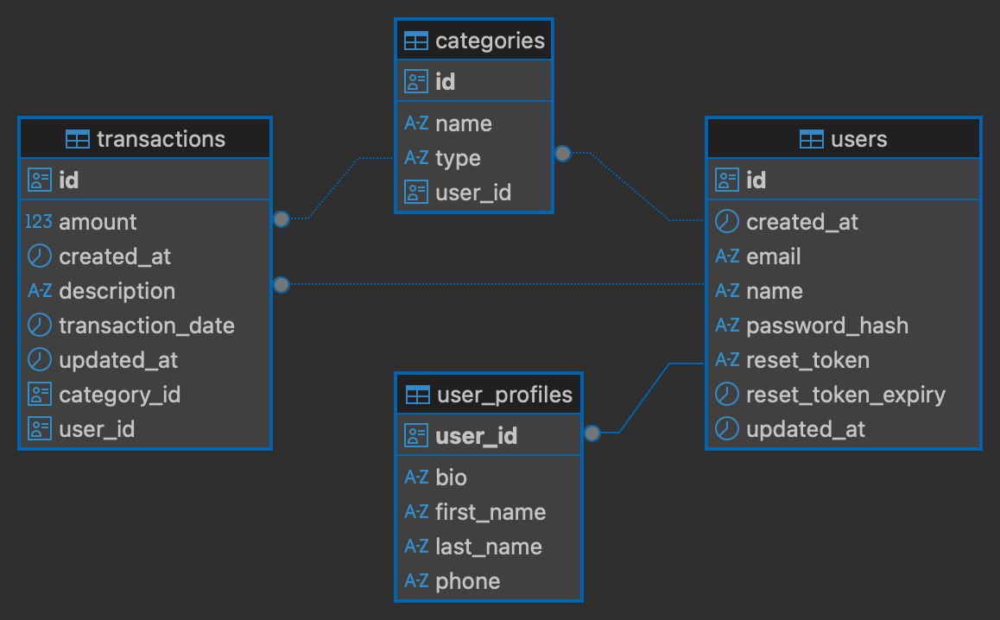

# 🖥️ Finance Tracker Backend

[](https://github.com/TranNgocVu-0904/finance-tracker-backend/actions/workflows/maven.yml)

## 📝 Test Coverage


## 🧠 Project Overview

**Expense Tracker** is a website for personal finance management. It allows users to track detailed transactions, categorize expenses, and evaluate their income and expenditure based on this information. The web app was built with a focus on **security, scalability, and ease of deployment**, this application is ideal for individuals who want to take control of their financial data.

## 🔗 Frontend Github Link

This is a link to the project's frontend on Github:
[Finance Tracker Frontend Github](https://github.com/TranNgocVu-0904/finance-tracker-frontend.git)

## 🛠️ Tech Stack

This project leverages technologies widely used in the Java programming language:

* **Core Framework:** [Spring Boot 3.5.11](https://spring.io/projects/spring-boot)

* **Language:** [Java 21](https://openjdk.org/projects/jdk/21/)

* **Security:** [Spring Security](https://spring.io/projects/spring-security) with [Stateless JWT](https://github.com/jwtk/jjwt) (jjwt 0.11.5)

* **Database:** [PostgreSQL 16](https://www.postgresql.org/)

* **ORM / Persistence:** [Hibernate 6](https://hibernate.org/) (via [Spring Data JPA](https://spring.io/projects/spring-data-jpa))

* **Validation:** [Spring Boot Starter Validation](https://beanvalidation.org/) for strict input integrity

* **Messaging:** [Spring Boot Starter Mail](https://spring.io/guides/gs/sending-mail/) for account recovery and alerts

* **API Documentation:** [Swagger UI](https://swagger.io/tools/swagger-ui/) & [OpenAPI 3.0](https://www.openapis.org/) (Interactive documentation and testing interface)

* **Quality Testing:** [JaCoCo](https://www.jacoco.org/jacoco) for precise test coverage reporting

* **Infrastructure:** [Docker](https://www.docker.com/) & [Docker Compose](https://docs.docker.com/compose/) for containerization

## 🔑 Key Features

* **Stateless Authentication:** Secure JWT-based login and registration system with automatic filtering via `OncePerRequestFilter`.

* **Comprehensive Transaction CRUD:** Fully manage income and expenses with categorical metadata and personal information ownership verification.

* **IDOR Protection:** Manual authorization checks at the Service layer to prevent unauthorized access or modification of non-self data.

* **Database Pool Optimization:** Utilize **HikariCP** with an "idle timeout" configuration to support serverless database environments.

* **Global Error Handling:** Centralized `@RestControllerAdvice` ensures all API errors return a consistent, readable JSON structure.

* **Quality Control:** Strict JaCoCo configurations to exclude DTOs, Entities, and Configs, ensuring accurate logic coverage.

## 🚧 System Architecture

The application follows a clean **Layered Architecture** pattern to ensure modularity and ease of maintenance:

1. **Security Layer:** Intercepts requests for JWT validation  and CORS policy enforcement.

2. **Controller Layer:** Defines REST endpoints for client-server communication.

3. **Service Layer:** Executes core business logic, including financial aggregations and authorization checks.

4. **Persistence Layer:** Manages database interaction via Spring Data JPA and Hikari connection pooling.

## ☁️ Infrastructure & Deployment

The system is architected for modern cloud-native environments, balancing high performance with resource efficiency.

### 1. Persistence Layer ([Neon](https://neon.com) & [Hibernate](https://hibernate.org/com))

* **ORM Framework ([Hibernate](https://hibernate.org/)):** Using **Hibernate 6** as the JPA implementation to manage entity relationships between `User`, `Transaction`, and `Category`.

* **Serverless Database ([Neon](https://neon.com)):** Integrated with **Neon PostgreSQL**, featuring **autoscale-to-zero** technology to reduce operational costs during inactivity.

* **Connection Pool Optimization:** Specifically tuned with **HikariCP** (`minimum-idle: 0`) and an optimized `connection-timeout`. This allows the Neon instance to enter sleep mode successfully while maintaining availability.

### 2. Cloud Hosting & CI/CD ([**Render**](https://render.com))

The backend is containerized and hosted on the [**Render**](https://render.com) cloud platform via an automated pipeline:

* **Containerized Environment:** Uses **Docker** and **Docker Compose** to package the Spring Boot API, PostgreSQL, and pgAdmin into a unified infrastructure.

* **Continuous Integration (CI):** Integrated with **GitHub Actions** to perform automated Maven builds and **JaCoCo** quality checks before every deployment to ensure source code reliability.

* **Continuous Deployment (CD):** Every push to the `main` branch triggers an automated build and deployment on Render via the project's **Dockerfile**, ensuring the latest features are always live.

## 🚀 Getting Started

### 🔧 Quick Start with [Docker](https://www.docker.com)

To launch the entire infrastructure (Backend, Database, and pgAdmin) locally:

1. **Clone the repository:**

    ```bash
    git clone https://github.com/TranNgocVu-0904/finance-tracker-backend.git
    
    cd finance-tracker-backend
    ```

2. **Configure Environment Variables:**

    Create a `.env` file from the provided example:

    ```bash
    cp .env.example .env
    ```

3. **Run the application:**

    ```bash
    docker-compose up -d --build
    ```

4. **Verify the deployment:**

    ```bash
    docker-compose ps
    ```

⭐ **Note:** If you want to stop running the docker, just run:

```bash
docker-compose down
```

or pausing:

```bash
docker-compose stop
```

## 🔐 Environment Variables

To run the application successfully, ensure the following variables are configured in your `.env` file (see [`.env.example`](.env.example) for reference):

| Variable                      |Description                               |
| :---                          |:---                                      |
| `SPRING_DATASOURCE_URL`       | PostgreSQL connection string (NeonURL)   |
| `SPRING_DATASOURCE_USERNAME`  | Database authorization username          |
| `SPRING_DATASOURCE_PASSWORD`  | Database authorization password          |
| `JWT_SECRET`                  | 256-bit secret key for signing tokens    |
| `SPRING_MAIL_USERNAME`        | SMTP server username (Support Email)     |
| `SPRING_MAIL_PASSWORD`        | SMTP app-specific password               |
| `FRONTEND_URL`                | <http://127.0.0.1:5500> (local host)     |

## 🔖 API Documentation (Swagger/OpenAPI)

Once the backend is running, you can explore the API documentation (Swagger UI) at:

> **URL:** `http://localhost:8081/swagger-ui/index.html`

The documentation provides information about request/response schemas, authentication requirements, and allows for direct testing of all endpoints.

## 📂 Project Structure

```bash
.
├── src/main/java/com/vutran/expensetracker
│   ├── common/
│   │   ├── config/
│   │   └── exception/   
│   ├── core/security/
│   │   ├── AuthTokenFilter.java
│   │   ├── JwtUtils.java
│   │   └── SecurityConfig.java
│   └── modules/
│       ├── user/
│       │   ├── controller/
│       │   ├── service/
│       │   ├── repository/
│       │   ├── entity/
│       │   └── dto/
│       ├── transaction/
│       │   ├── controller/
│       │   ├── service/
│       │   ├── repository/
│       │   ├── entity/
│       │   └── dto/
│       ├── category/
│       │   ├── controller/
│       │   ├── service/
│       │   ├── repository/
│       │   ├── entity/
│       │   └── dto/
│       └── analytics/
│           ├── controller/
│           ├── service/
│           ├── repository/
│           ├── entity/
│           └── dto/
├── src/main/resources
│   └── application.yml
├── src/test/java/
├── Dockerfile
├── docker-compose.yml
└── pom.xml
```

## 🧪 Running Tests

To execute the unit test and generate the coverage result, run:

1. **Start the database separately on Docker:**

    ```bash
    docker-compose up -d postgres_db
    ```

    *(Chỉ bật DB thôi, không cần bật service backend trên Docker).*

2. **Then, run:**

    ```bash
    ./mvnw clean test
    ```

 > The JaCoCo report will be generated at: `target/site/jacoco/index.html`

1. **View JaCoCo results:**

After testing, open the file `target/site/jacoco/index.html` in your folder to see the coverage.

## 🎉 Database ERD (Entity Relationship Diagram)


